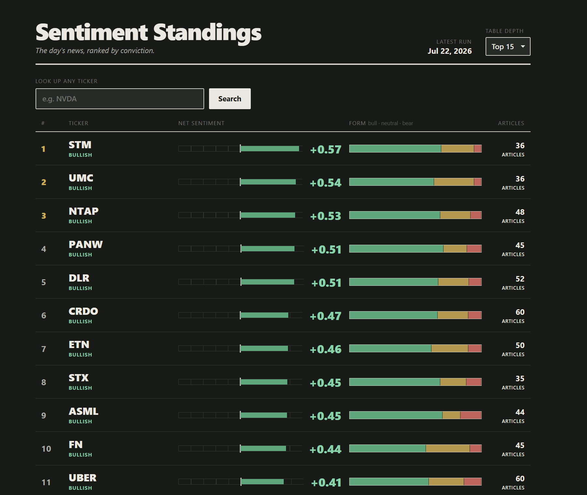
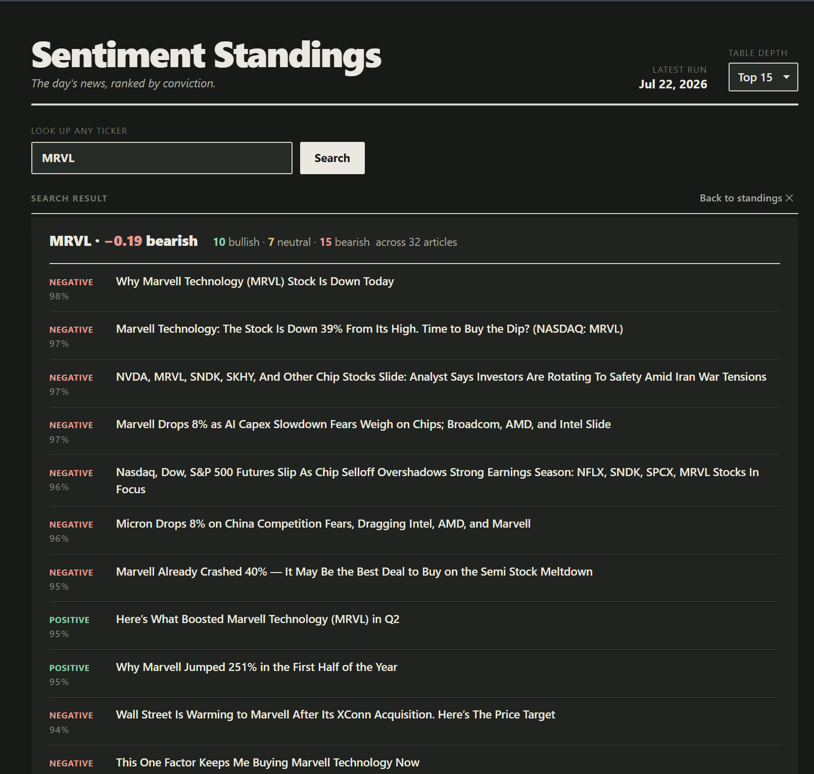

# Sentiment Standings

**A daily league table of stock-market news sentiment.** It scrapes the day's
news for a universe of AI, semiconductor, data-center and cloud-computing
companies, scores every headline with a finance-tuned language model, and ranks
each ticker by how bullish or bearish the coverage is — so you can see the day's
standout movers in seconds, without reading the news yourself.



## What it does

- **Scrapes** per-ticker news headlines from Yahoo Finance.
- **Scores** each article with [FinBERT](https://huggingface.co/ProsusAI/finbert),
  a BERT model fine-tuned on financial text, into `positive` / `negative` /
  `neutral`.
- **Aggregates** those into one signed score per ticker — the average of each
  article's signed confidence — and labels it **bullish**, **bearish**, or
  **neutral** (a ±0.15 dead band keeps borderline noise out of the extremes).
- **Ranks** every ticker into a standings table, most bullish first.
- **Serves** it all as a dark, glanceable dashboard and a small JSON API.

Every number is **auditable**: each ticker's score traces back to the exact
articles that produced it, each with its own per-article verdict.

### Reading the dashboard

Each row is one ticker's latest run:

| Column | Meaning |
|---|---|
| **#** | Rank in today's standings (top 3 highlighted) |
| **Ticker · label** | The symbol and its overall bullish / bearish / neutral call |
| **Net sentiment** | A gauge that deflects from centre — right = bullish, left = bearish — plus the signed score |
| **Form** | A stacked bar breaking that ticker's articles into bull · neutral · bear |
| **Articles** | How many headlines back the score (low counts are flagged as thin coverage) |

Sentiment is never shown by colour alone — every cue also carries a word, a sign,
or a bar direction, so it stays legible for red-green colour vision deficiency.

## Searching an individual stock

Beyond the ranked board, you can **look up any ticker** in the universe — not
just the ones on the visible leaderboard. The search returns that stock's net
score, its bull/neutral/bear breakdown, and the **full list of articles read
today**, each with its per-article sentiment verdict and confidence, linked back
to the source.



## API

The front-end is served by the same FastAPI process. The JSON endpoints:

| Endpoint | Returns |
|---|---|
| `GET /picks?limit=N` | The ranked leaderboard: each ticker's score, label, article count, and bull/neutral/bear counts. |
| `GET /tickers/{ticker}` | One ticker's latest sentiment plus a `coverage` list of every article behind it. |
| `GET /tickers/{ticker}/articles?label=` | The articles for a ticker's latest run, optionally filtered to `positive` / `negative` / `neutral`. |

Interactive API docs are available at `/docs` when the server is running.

## Tech stack

- **Backend:** [FastAPI](https://fastapi.tiangolo.com/) + Uvicorn
- **Storage:** SQLite (append-only — each daily run adds a new row per ticker, so
  history accumulates)
- **Scraping:** [yfinance](https://pypi.org/project/yfinance/)
- **Scoring:** [FinBERT](https://huggingface.co/ProsusAI/finbert) via 🤗
  `transformers`
- **Front-end:** vanilla HTML / CSS / JS (no build step), served as static files
  by FastAPI

## Running it

```bash
python3 -m venv .venv
source .venv/bin/activate
pip install -r requirements.txt

uvicorn app:app --reload
```

Then open **http://127.0.0.1:8000/**.

> **Note:** `requirements.txt` covers serving the dashboard (FastAPI, Uvicorn,
> yfinance). Regenerating sentiment data with FinBERT additionally needs
> `transformers` and `torch`, which are large and are installed separately.

### Project layout

```
app.py                 FastAPI app + routes, serves the front-end
sources/
  data.py              SQLite: schema, storage, and read queries
  scrapers.py          Yahoo Finance news scraper
  sentiment.py         FinBERT scoring + per-ticker aggregation
  tickers.py           The ticker universe
  helper.py            Headline-matching utilities
frontend/              The dashboard (index.html, styles.css, app.js)
```

---

*Sentiment, not investment advice. Scores are derived from news headlines and
are not a recommendation to buy or sell.*
